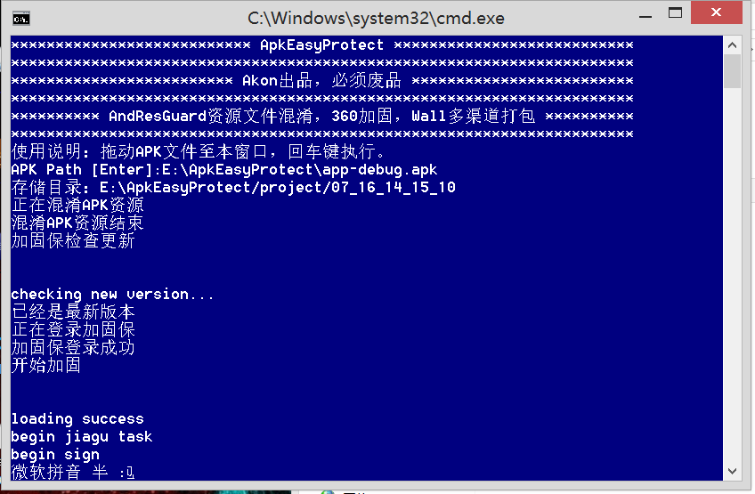
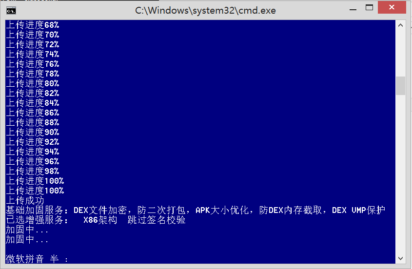
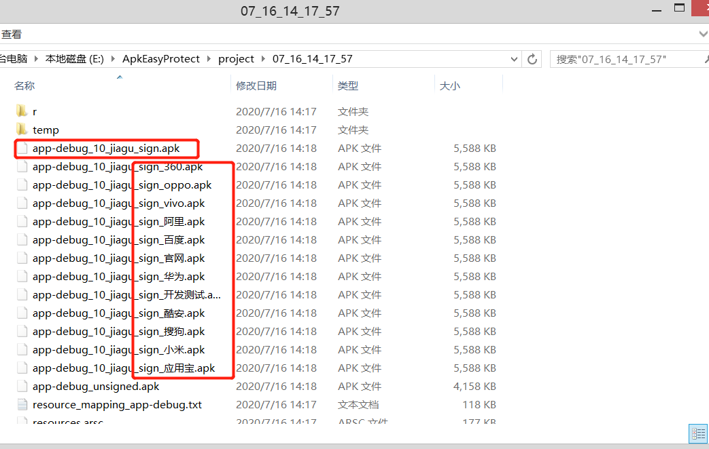
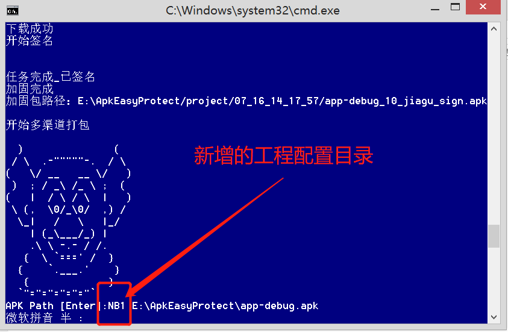
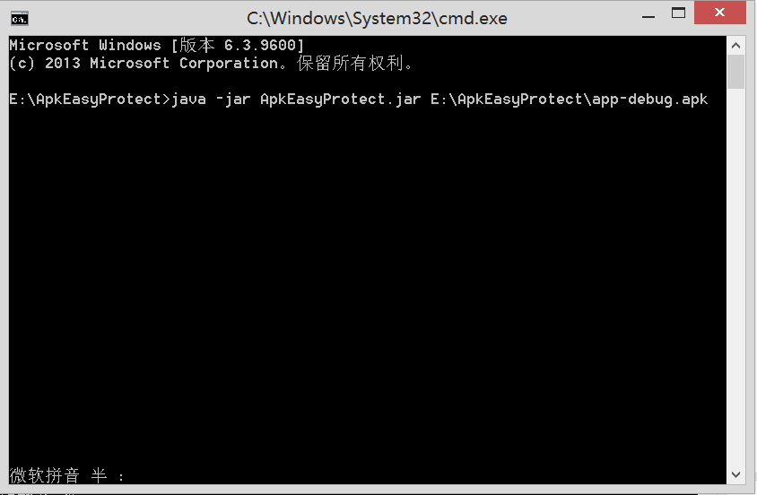
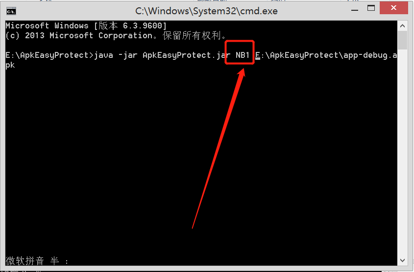

# ApkEasyProtect 使用说明 #

一行命令实现AndResGuard资源文件混淆，360加固，Wall多渠道打包

基于JAVA,理论上不限平台（Windows/Linux）

我先吐槽：  
1.小米商店上架。审核人员，呵呵，原生代码写的APK，驳回说是网页模板。申诉也不行。he tui！  
2.oppo和vivo企业认证还停留在远古  

## 背景
多渠道打包后，360加固将渠道信息擦出，Walle推荐的解决方案[详情见：360加固失效](https://github.com/Meituan-Dianping/walle/wiki/360加固失效？)  
1.需要python环境，可我不想配，废话电脑里已经这么多配置了  
2.那就造一个吧。  
3.半天时间匆匆写完，代码在code里，没什么注释，凑合看吧，反正你要的是工具。  

## 先看效果
## 工具

## 命令行

## 前置条件：
1.JDK环境变量一定要配置！！！  
2.路径地址一定不要有空格，包括本工具目录！！！！

## 配置
tools\project目录下  

config.json

{  
  "enabledAndResGuard": true,//是否开启资源文件混淆  
  "outputPath":"E:/Demo",//输出目录  
}  

config_360.json  

{  
    "login":"<360用户名> <登录密码>",  
	"checkUpdate":true,//是否自动更新加固保  
    "config":"-x86 -piracy -crashlog", //配置加固可选项  
	----------------------可选增强服务-------------------------------  
		[-crashlog]				【崩溃日志分析】  
		[-x86]					【x86支持】  
		[-analyse]				【加固数据分析】  
		[-nocert]				【跳过签名校验】  
		[-piracy]				【盗版监测】  
	----------------------高级加固选项-------------------------------  
		[-vmp]					【全VMP保护】  
		[-data]					【本地数据文件保护】  
		[-assets]				【资源文件保护】  
		[-filecheck]				【文件完整性校验】  
		[-ptrace]				【Ptrace防注入】  
		[-so]					【SO文件保护】  
		[-dex2c]				【dex2C保护】  
		[-string_obfus]				【字符串加密】  
		[-dex_shadow]				【DexShadow】  
		[-so_private]				【SO防盗用】  
		[-double_check]				【双开检测】  
    "importsign":"<密钥例如：123.key> <密钥密码> <别名> <别名密码>",  
    "config_so":"",//配置需要加固的SO文件，以空格分隔  
    "config_assets":"",//配置需要忽略的资源文件，以空格分隔  
    "config_so_private":""//配置防盗用的SO文件，以空格分隔  
}  

config_andresguard_resproguard.xml //andresguard配置，比如白名单等等  
[详情见：Andresguard](https://github.com/shwenzhang/AndResGuard)  

config_walle.json  
{  
	"channelPath":"E:/Demo/project/config_walle_channel.json",//渠道文件路径  
}  

config_walle_channel.json //wall渠道文件，比如渠道信息等等  
[详情见：Walle](https://github.com/Meituan-Dianping/walle/tree/master/walle-cli)  

## 命令行：
java -jar ApkEasyProtect.jar XXX.APK

## 如果多个工程？
copy 上面的project，粘贴重命名NB1,安装上面的步骤重新配置

java -jar ApkEasyProtect.jar NB1 XXX.APK

## 致谢

[AndResGuard](https://github.com/shwenzhang/AndResGuard)  
[360加固保](https://jiagu.360.cn)  
[Walle](https://github.com/Meituan-Dianping/walle/tree/master/walle-cli)
